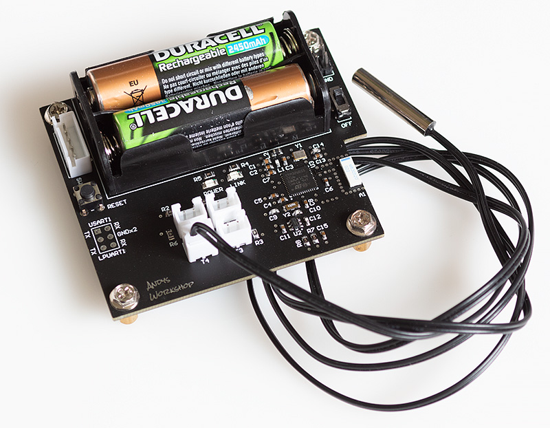

# Bluetooth temperature sensor

This repository contains the source code to the firmware for a bluetooth temperature sensor based around the STM32WB55 wireless range of MCUs. This project uses the 256kB STM3255WBCCU6 part.

The documentation for this project can be found at [my website](https://andybrown.me.uk/2021/10/10/stm32wb55).



## Building the firmware

The firmware has been tested to build successfully on Ubuntu Linux and it should work on any similar system. You'll need to have the `arm-none-eabi` gcc toolchain installed. If you haven't got this then Google 'arm-none-eabi' for instructions how to install it.

If you also want to flash the firmware to a device over an SWD connection managed by ST-Link then you'll also need the `STM32CubeProgrammer` package. Again, if you haven't got it then Google it and follow the online installation instructions. When installing on a Linux system then do it from an elevated `sudo` prompt so that it gets installed into `/usr/local/STMicroelectronics/STM32Cube/STM32CubeProgrammer`.

A `Makefile` is provided that will build the firmware and optionally flash it. Here are example invocations:

```
make release     ; builds an optimised binary with -O3
make debug       ; builds a debug binary with -O0 -g3
```

If you also want to automatically flash the firmware using a connected ST-Link debugger then just append the `flash` target.

```
make release flash
make debug flash
```

The `flash` target assumes that you've installed `STM32CubeProgrammer` into `/usr/local/STMicroelectronics/STM32Cube/STM32CubeProgrammer`. If this is not the case then edit `Makefile` and correct the `PROGRAMMER` macro at the top of the file.

All generated files are placed in a `build` subdirectory. There is a `clean` target that will wipe the build directory. If you're switching between `release` and `debug` targets then you should run a `clean` first.

## Developing the firmware

If you'd like to edit the firmware in the STM32Cube IDE then `.project` and `.cproject` files are provided that can be imported directly into the IDE. 

Please note that if you must use the CubeMX code generator then you should always run a `git diff` afterwards to see what's been overwritten as it can remove source code edits that I have made.
